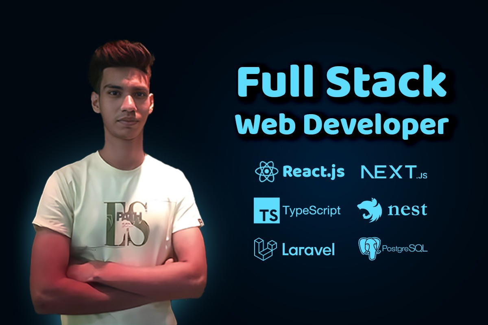

# 👋 Hi, I'm Rubayed Ahammed Rahi

<!-- ===================== Tech Badges ===================== -->

    
  

    
    &nbsp;
    
  

## 🧠 About Me

I'm a passionate Full Stack Developer who loves building scalable web applications and solving real-world problems.
Currently working on ERP systems and improving my backend & system design skills.

---

## 🧰 Tech Stack

### 🚀 Frontend

### ⚙️ Backend

### 🧩 Languages

### 🗄️ Database

<!-- ===================== STATS ===================== -->

### 📊 GitHub Stats
<!-- Dark mode -->

### 🎯 Currently Learning

* Laravel (PHP Framework)
* Advanced React Patterns
* PostgreSQL Optimization

---

### 💼 Currently Working On

* Working on ERP web application
* Personal portfolio website redesign
* Task management application with real-time updates

---

### ⭐ Highlight Projects

* **Modern Portfolio** — Next.js, Tailwind CSS, Framer Motion
* **TaskFlow API** — Nest.js, PostgreSQL, Prisma
* **Realtime Chat** — React, Socket.io, Express.js

---

### 🧠 Experience

* Built and maintained full‑stack applications with React/Next.js, Nest.js & PostgreSQL
* Designed REST APIs, database schemas, optimized queries
* Implemented reusable UI components and responsive layouts

---

### 🎓 Education & Certifications

* Successfully completed Level 3 under NHRDF
* Online certifications (JS  / React / Express / mongoDB)
* Currently working as a Junior Developer at Globe ERP

### 📬 Contact

---

  © Bisakto Rahi — Building cool things with code

